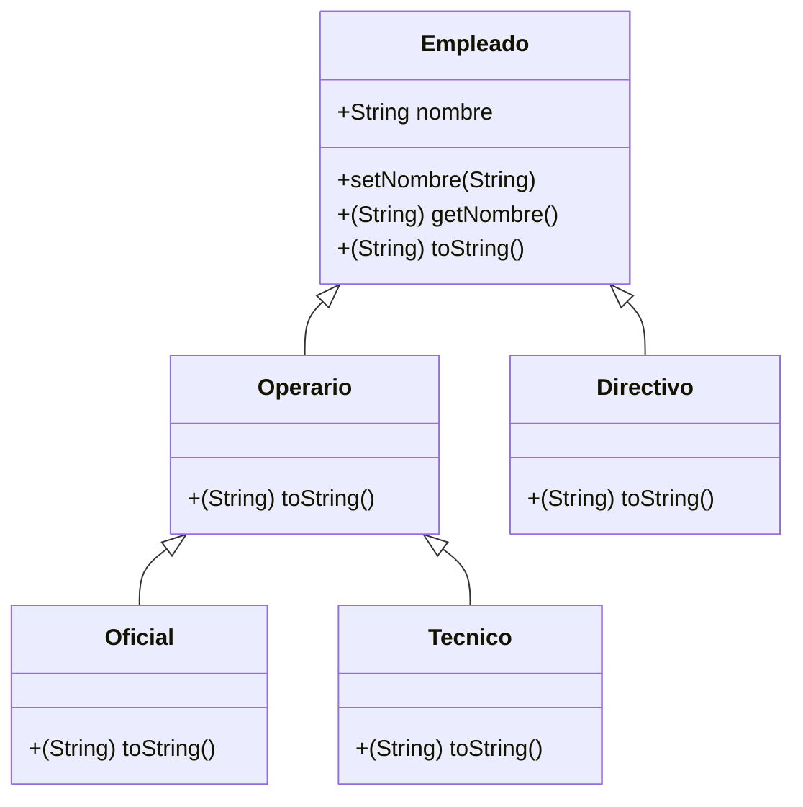

<span style='color:green'> (ra2.a, ra2.b, ra2.h, ra2.i, ra4.a, ra4.b, ra4.c, ra4.d, ra4.e, ra4.g, ra4.i, ra7.a, ra7.b, ra7.c, ra7.d, ra7.e, ra7.f, raa7.g)</span>

La herencia se puede definir como el proceso donde una clase adquiere las propiedades (métodos y campos) de otra. Con el uso de la herencia, la información se hace manejable en un orden jerárquico.

La clase que hereda las propiedades de otros se conoce como **subclase** (clase derivada, clase hija) y la clase cuyas propiedades se heredan se conoce como **superclase** (clase base, clase padre).

## Reino animal

Vamos a verlo con un ejemplo del reino Animal:

Empezamos con una simplificación de aquellas **características** que tienen **todos los animales** y aquellas **cosas** que son capaces de hacer **todos los animales**.

Empecemos con un modelo muy básico en el que sólo existen dos tipos de animales: perros y gatos. 

Lo primero que hemos de hacer es intentar obtener **qué atributos tienen todos estos animales en común y qué son capaces de hacer**.

**Atributos comunes**

* Nombre

* Color
* ....

**¿Qué son capaces de hacer?**

* nacer
* crecer
* reproducirse
* morir
* respirar
* moverse
* comer
* comunicarse
* mamar
* ...

En el siguiente modelo, sólo vamos a implementar: nacer (que es el constructor), respirar, moverse, comunicarse, mamar.

La única cosa que hacen de forma diferente los perros y los gatos es comunicarse: mientras el perro hace "guau" el gato hace "miau". Pero todos ellos, nacen de la misma forma, respiran mediante pulmones, se mueven a 4 patas y maman de la misma forma. Además, los perros son capaces de traernos las zapatillas y los gatos juegan con ovillos.

Por tanto nuestra primera versión de la clase `Animal`, será de la siguiente forma:

```java
/**
 * Esta clase da cierta funcionalidad para un Animal que tiene un nombre y sabe hacer ciertas cosas!
 */
public class Animal
{
    private String nombre;

    /**
     * Constructor para objetos de la clase Animal
     */
    public Animal(String nombre)
    {
        this.nombre = nombre;
    }

    public String getNombre()
    {
        return nombre;
    }

    public void setNombre(String nombre)
    {
        this.nombre = nombre;
    }

    /**
     * El método comunicarse es común para el gato y el perro, aunque cada uno lo hace de una forma
     * 
     */
    public void comunicarse()
    {
        System.out.println("Mi nombre es " + nombre);
    }

    /**
     * El método respirar es común para el gato y el perro
     * 
     */
    public void respirar()
    {
        System.out.println("Respiro aire por los pulmones");
    }    
    /**
     * El método moverse es común para el gato y el perro
     * 
     */
    public void moverse()
    {
        System.out.println("Me muevo a 4 patas");
    }
    /**
     * El método mamar es común para el gato y el perro
     * 
     */
    public void mamar()
    {
        System.out.println("Cuando soy pequeño mamo");
    }
    /**
     *
     * toString() Representación como cadena de un objeto animal
     *
     * @returns  La representación como cadena de un objeto animal
     *
     */
    @Override
    public String toString()
    {
        return "Animal: " + nombre;
    }
}
```


En java, **todas las clases extienden** por defecto de la clase `Object`. Como se ve, hemos redefinido el método `toString()` en la clase `Animal`.

Ahora vamos a implementar la clase `Perro`, que es un tipo de `Animal`. En java se usa la palabra reservada `extends` para implementar la herencia

```java
public class Perro extends Animal{

    Perro(String nombre){
        //Llamamos al constructor de Animal
        super(nombre);
    }

    public void traerZapatillas(){
        System.out.println("Toma amo tus zapatillas");
    }

    /**
     * El perro se comunica de forma distinta a Animal y, por eso, se sobrescribe
     */   
    @Override
    public void comunicarse()
    {
        System.out.println("guau");
    }
}
```


* Al extender `Animal`, `Perro` hereda todos los datos y métodos que pertenecen a `Animal`
* Como `nombre` era una variable miembro en `Animal`, también pertenece a la clase `Perro`.
* Dado que `nombre` era privado en `Animal`, no se puede acceder directamente en la clase `Perro`.  `Privado` realmente significa privado para código fuera de la clase en la que se define.
* La variable `nombre` todavía está disponible indirectamente en `Perro` porque `Perro` heredó el método de acceso público `getNombre()` de Animal.
* Ya que `Perro` heredó de `Animal`, decimos que "`Perro` es una **subclase** de `Animal`" y "`Animal` es la **superclase** de `Perro`". También podríamos decir que "`Perro` fue derivado de la clase base `Animal`".
* La herencia captura una relación Es-Un (Is-A): cada objeto `Perro` "es-un" objeto `Animal` .
* Al heredar una clase, estamos construyendo una clase más especializada que la superclase que se extiende.
* Cada clase extiende la clase `Object` por defecto. Cada clase hereda de `Object`. Como resultado, cada `Animal` es un `Object`. Cada `Perro` es un `Object` porque también es un Animal.


Como veis, `Perro` tiene todos los métodos que tiene `Animal`, hemos rescrito `comunicarse()` y tiene un nuevo método llamado `traerZapatillas()`.

Por su parte, la clase `Gato` tiene la siguiente implementación:

```java
public class Gato extends Animal{
    public Gato(String nombre){
        super(nombre);
    }
    
    public void perseguirUnOvillo(){
        System.out.println("Perseguir Un Ovillo");
    }
    
    @Override
    public void comunicarse()
    {
        System.out.println("Miau");

    }
}
```


En los constructores de `Perro` y `Gato`, 

```java
/**
 * Constructor de objetos de la clase Gato
*/
public Gato(String nombre)
{
    super(nombre);
}
```

vemos la siguiente instrucción:

```java
super(nombre);
```

La primera línea en un constructor para una subclase es una llamada de constructor a la superclase invocando `super()`. Al pasar los parámetros a la llamada `super()`, se invoca el constructor correspondiente. Es decir, estamos llamando al constructor de `Animal` pasándole el parámetro nombre. 

## Sobrescritura

Tanto las clases `Gato` y `Perro` sobrescriben el método `comunicarse()` de la clase `Animal`. De esta forma, los métodos sobrescritos pueden ser más particulares en las clases que los sobrescriben.

Todos los métodos que sobrescriban uno de su clase padre, deben anteponer `@Override` al nombre del método.

## Clases abstractas

Según este modelo, podemos crear un objeto de la clase `Animal`. Pero en la naturaleza esto no ocurre: un `Animal` **siempre** es de algún tipo: `Perro` o `Gato`.

 

Para que no se pueda crear un objeto de un clase determinada, hemos de definirla como **abstracta**

Para ello, se usa la palabra reservada **abstract**:

```java
public abstract class Animal
```

Y ahora ya no podemos crear ningún `Animal`, sólo `Perros` o `Gatos`


## Tiburón

Vamos a incorporar a nuestro pequeño reino animal a los tiburones.

Pero claro, los tiburones no maman. Así que de alguna forma, hemos de eliminar el método `mamar` de la clase `Animal`.

Para ello, creamos una nueva clase, `Mamifero`, de la que hereden los `gatos` y los `perros` y que implemente el método `mamar`, **eliminando** este método de la clase `Animal`.

De esta forma, la clase `Animal` contiene todo lo común a **todos** los animales: `Perros`, `Gatos` y `Tiburones`. Y la clase `Mamifero` contiene **sólo** lo común para los `Perros` y `Gatos`.

Se trata de encapsular las cosas comunes a varias clases en una superclase.

```java
public abstract class Mamifero extends Animal {
    public Mamifero(String nombre) {
        super(nombre);
    }
    /**
     * El método mamar es común para el gato y el perro
     *
     */
    public void mamar()
    {
        System.out.println("Cuando soy pequeño mamo");
    }
    
}
```

Por tanto, la clase `Animal` ya no tiene el método `mamar()`.

```diff
//Formato diff
@@ -51,16 +51,6 @@
     }

     /**
-     * El método mamar es común para el gato y el perro
-     *
-     */
-    public void mamar()
-    {
-        System.out.println("Cuando soy pequeño mamo");
-    }
-
-
-    /**
      *
      * toString() Representación como cadena de un objeto animal
      *

```
Y ahora los `Perros` y los `Gatos` heredan de `Mamifero`, que a su vez hereda de `Animal` que, a su vez, hereda de `Object`.


Ahora implementamos la clase `Tiburon`, que hereda de `Animal`.

```java
public class Tiburon extends Pez implements Jugar{
    public Tiburon(String nombre){
        super(nombre);
    }

    @Override
    public void comunicarse()
    {
        System.out.println("Me comunico con las aletas");
    }
}
```


Pero claro, como hereda el método `respirar` de `Animal`, resulta que:


Y también hereda `moverse()`, pero el tiburón nada, no se mueve a 4 patas.

Y esto no es correcto. Por tanto, en este caso vamos a hacer que los métodos `respirar`  y `moverse` también sean **abstractos**: todos los animales respiran y se mueven pero cada uno lo hace de una forma.

Para definir un método como abstracto, se antepone la palabra reservada `abstract`. 

```java
/*
 * El método respirar es común para todos los animales pero cada uno lo hace a su manera
 */
public abstract void respirar();

/**
 * El método moverse es común para todos los animales.
 */
public abstract void moverse();
```

Fijaos que no tienen **cuerpo**!

El problema es que, ahora nuestra aplicación no compila:


Esto es así, porque todas las clases que no son abstractas deben implementar los métodos de las superclases que sean abstractos:


Como tanto `Perro` como `Gato`, extienden `Mamifero` y todos ellos respiran con pulmones y se mueven a 4 patas, vamos a implementar el método `respirar()` y `moverse()` en la clase `Mamifero`:

```java
public abstract class Mamifero extends Animal {
    public Mamifero(String nombre) {
        super(nombre);
    }
    /**
     * El método mamar es común para todos los mamíferos
     */
    public void mamar()
    {
        System.out.println("Cuando soy pequeño mamo");
    }
    /**
     * El método respirar es común para todos
     */
    @Override
    public void respirar()
    {
        System.out.println("Respiro aire por los pulmones");
    }

    /**
     * El método respirar también es común para todos
     */
    @Override
    public void moverse(){
        System.out.println("Me muevo a 4 patas");
    }
}
```

Ahora la única clase que no compila es `Tiburon`, porque tiene que implementar los métodos abstractos `respirar()` y `moverse()`:

```java
public class Tiburon extends Pez{
    public Tiburon(String nombre){
        super(nombre);
    }

    @Override
    public void comunicarse()
    {
        System.out.println("Me comunico con las aletas");
    }

    @Override
    public void respirar()
    {
        System.out.println("Respiro con branquias");
    }

    @Override
    public void moverse(){
        System.out.println("Me muevo nadando");
    }
}
```

Ahora ya funciona todo:


## Pez payaso

Incorporamos a nuestro pequeño zoo a los peces payaso, que también respiran por branquias y nadan porque son peces al igual que los tiburones.

Como comparten rasgos con los `Tiburones`, vamos a crear una clase que herede de `Animal` llamada `Pez`, de las que, a su vez hereden `Tiburon` y `Pez Payaso`

```java
public abstract class Pez extends Animal {
    public Pez(String nombre) {
        super(nombre);
    }
    @Override
    public void respirar()
    {
        System.out.println("Respiro con branquias");
    }

    @Override
    public void moverse(){
        System.out.println("Me muevo nadando");
    }
}
```

Ahora ya podemos eliminar estos métodos de la clase `Tiburon`

```java
public class Tiburon extends Pez
{

    /**
     * Constructor for objects of class Tiburon
     */
    public Tiburon(String nombre)
    {
        super(nombre);
    }

    /**
     * El método comunicarse es especifico para el Tiburon
     * 
     */
    public void comunicarse()
    {
        System.out.println("Arqueo el cuerpo para comunicarme");
    }

}

```
Y esta sería la implementación del `Pez Payaso`

```java
public class PezPayaso extends Pez{
    public PezPayaso(String nombre){
        super(nombre);
    }

    /**
     * El método comunicarse es particular para el pez payaso
     */
    @Override
    public void comunicarse()
    {
        System.out.println("Me comunico haciendo burbujas");
    }

}
```

Y este es el resultado:


## Interfaces

Vamos a suponer que tenemos un zoo y a los gatos y tiburones les hemos enseñado a jugar a varias cosas: saltar por un aro, perseguir un objeto, .... Pero los perros y los peces payaso no saben hacerlo. ¿Cómo hacemos para que clases que comparten acciones pero están en ramas distintas de nuestra jerarquía de clases puedan hacer una misma cosa? La respuesta son las interfaces.

Una interfaz es una especie de contrato que han de cumplir todas aquellas clases que implementen la misma.

Vamos a verlo con un ejemplo: 


Hemos definido una interfaz llamada `Jugar` que tiene dos métodos: `saltarPorUnAro()` y `perseguirUnObjeto()`. Fijaos que los métodos están vacíos, ya que cada clase que implemente la interfaz lo hará de una forma distinta.

Ahora vamos a hacer que el `Gato` *sepa* `Jugar`. Para ello hemos de modificar la cabecera de la clase para que implemente esta interfaz e implementar los métodos definidos en ella:

```java
public class Gato extends Mamifero implements Jugar{
    public Gato(String nombre){
        super(nombre);
    }
    public void perseguirUnOvillo(){
        System.out.println("Perseguir Un Ovillo");
    }
    @Override
    public void comunicarse()
    {
        System.out.println("Miau");

    }
    @Override
    public void saltarPorUnAro(){
        System.out.println("Sé saltar por aro");
    }

    @Override
    public void perseguirUnObjeto(String  objeto){
        System.out.println("Sé perseguir " + objeto);
    }
}
```

Y también hacemos que los `Tiburones` *sepan* `Jugar`:

```java
public class Tiburon extends Pez implements Jugar{
    public Tiburon(String nombre){
        super(nombre);
    }

    @Override
    public void comunicarse()
    {
        System.out.println("Me comunico con las aletas");
    }

    @Override
    public void saltarPorUnAro(){
        System.out.println("Sé saltar por aro");
    }

    @Override
    public void perseguirUnObjeto(String  objeto){
        System.out.println("Sé perseguir " + objeto);
    }
}
```


Ahora vamos a contratar a un `Entrenador` para nuestro zoo. Este será el encargado de entrenar a los animales, pero, evidentemente sólo puede hacerlo con aquellos que sepan *jugar*.

Para simplificar, vamos a hacer que herede directamente de `Mamífero`.


Y ahora implementamos un método para entrenar a un `Animal`. Pero sólo puede entrenar a aquellos que saben *jugar*!

Para eso están las interfaces. 

```java
/**
 * Permite entrenar a aquellos animales que saben jugar
 */
public void entrenar(Jugar animalQueSabeJugar){
    animalQueSabeJugar.saltarPorUnAro();
}
```

Como se puede observar, el método tiene un parámetro que es una interfaz. De esta forma, sólo podemos invocar a este método si le pasamos un `Animal` que implemente dicha interfaz.


Al intentar pasar como argumento al método `Entrenador.entrenar()`, da un error al pasarle un objeto de la clase `Perro` que no implementa la interfaz `Jugar`.

Sin embargo, sí que podemos entrenar al `Gato` porque sí que la implementa.

Ahora vamos a suponer que el mismo entrenador tiene otro método llamado `dejarEntrar`. Este método recibe como parámetro un `Animal`. Pero sólo va a dejarle entrar si sabe *jugar*.

En este caso usamos `instanceof` que permite saber si un clase es de un tipo concreto (o hereda) o si implementa una interfaz (o una superclase la implementa).

```java
/**
 * Solo deja entrar a aquellos animales que saben jugar
 */
public void dejarEntrar (Animal animal){
    if (animal instanceof Jugar){
        System.out.println("Pasa y te entreno");
    }else{
        throw new IllegalArgumentException(animal.getClass().getName() + " no implementa la interfaz Jugar");

    }
}
```

Ahora si intentamos que al perro le deje pasar el entrenador saltará una excepción:

```java
 entrenador.dejarEntrar(perro);
```

```
Exception in thread "main" java.lang.IllegalArgumentException: Perro no implementa la interfaz Jugar
```

Por tanto, deberíamos atrapar esta excepión.

A todos los efectos, las interfaces son como las clases. Donde se puede usar una variable de tipo clase, también se puede usar una variable de tipo interfaz.

Además, las interfaces también siguen los mismos principios de la herencia: es decir, una interfaz puede *extender* a otra.

Las interfaces se usan profusamente en los frameworks de desarrollo para no estar _atados_ a una implementación concreta de una clase. Por ejemplo, pueden tener un método llamado `conectar` al que se le pasa un argumento  `Conectable` que es una interfaz. De esta forma, el desarrollador puede crear un objeto que se conecte a una base de datos o un objeto que se conecte a una hoja de cálculo siempre y cuando ambos implementen dicha interfaz.

Otro ejemplo sería la implementación de una clase `Fotografo`. Este tiene la capacidad de realizar fotografías mediante algún dispositivo. Si en su método `disparar` definimos un parámetro para un objeto `Camara` ya no podrá realizar fotos con un `Movil` . Pero si definimos  un parámetro con una interfaz como por ejemplo `Disparable` sí que podrá si ambas clases implementan dicha interfaz. Si el día de mañana aparece otro dispositivo para realizar fotos también podrá siempre que implemente la interfaz.

## Llamada a métodos de la superclase

Vamos a suponer que queremos que un método heredado también haga, además, lo que hace el padre. Para ello usamos el método `super.nombreDeMetodo()`.

Ahora mismo, cuando el `Gato` se comunica, imprime lo siguiente:


Pero si modificamos el método:

```java
public void comunicarse()
{
	super.comunicarse();
	System.out.println("Miau");
}
```

Ahora imprime


Porque primero está llamando al método `comunicarse` de la clase de la que hereda.

Y si lo modificamos de la siguiente forma:

```java
public void comunicarse()
{
	System.out.println("Miau");
	super.comunicarse();
}
```

Ahora imprime:


## Proyecto trabajadores

<span style='color:green'> (ra2.a, ra2.b, ra2.h, ra2.i, ra4.a, ra4.b, ra4.c, ra4.d, ra4.e, ra4.g, ra4.i, ra7.a, ra7.b, ra7.c, ra7.d, ra7.e, ra7.f, raa7.g)</span>

Implementa la siguiente jerarquía de clases:



## Proyecto Network

<span style='color:green'> (ra2.a, ra2.b, ra2.h, ra2.i, ra4.a, ra4.b, ra4.c, ra4.d, ra4.e, ra4.g, ra4.i, ra7.a, ra7.b, ra7.c, ra7.d, ra7.e, ra7.f, raa7.g)</span>

El proyecto *network* implementa un prototipo de una pequeña parte de una aplicación de red social. La parte en la que nos centraremos es la *fuente de noticias*, la lista de mensajes que aparecerá en pantalla cuando el usuario abra la página principal de la red social.

Aquí empezaremos de forma simple y poco ambiciosa, con la idea de ampliar y  mejorar la aplicación más adelante. Inicialmente, sólo tenemos dos tipos de publicaciones en nuestra fuente de noticias: publicaciones de texto  (que denominaremos simplemente mensajes) y publicaciones fotográficas compuestas por una fotografía y un título.

La parte de la  aplicación de la que haremos un prototipo es el motor que almacena y  visualiza estas publicaciones. La funcionalidad que queremos  proporcionar con este prototipo debe incluir al menos lo siguiente:

- Debe generar un ID único para cada publicación.
- Debe permitirnos crear publicaciones de texto y fotográficas
- Las publicaciones de texto están compuestas por un mensaje de longitud  arbitraria. Las publicaciones fotográficas están compuestas por una  imagen y un título. Con cada publicación se almacenan algunos detalles  adicionales.
- Ha de proporcionarse una función de búsqueda que nos permita localizar, por ejemplo, todas las publicaciones de un cierto usuario.
- Debe permitir mostrar la lista de las publicaciones de un usuario.
- Ha de hacer posible eliminar información.

Los detalles que queremos almacenar para cada publicación de mensaje son:

- Debe generar un ID único para cada publicación.
- El nombre de usuario del autor.
- El texto del mensaje.
- Una marca temporal (instante de la publicación)
- El número de personas a las que les ha gustado la publicación.
- Una lista de los comentarios que otros usuarios han hecho acerca de esta publicación.

Los detalles que queremos almacenar para cada publicación fotográfica son:

- El nombre del usuario del autor
- El nombre del archivo de imagen que hay que visualizar.
- El título de la fotografía (una línea de texto).
- Una marca temporal (instante de la publicación)
- El número de personas a las que les ha gustado la publicación.
- Una lista de los comentarios que otros usuarios han hecho acerca de esta publicación.