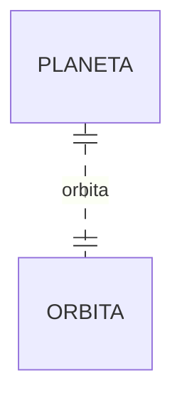
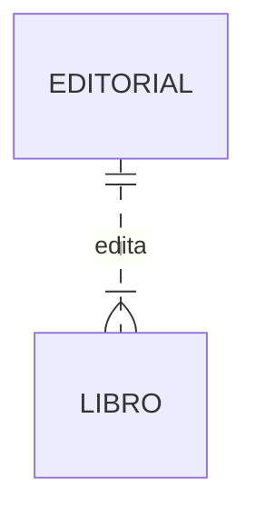
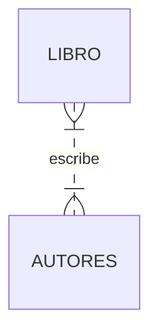
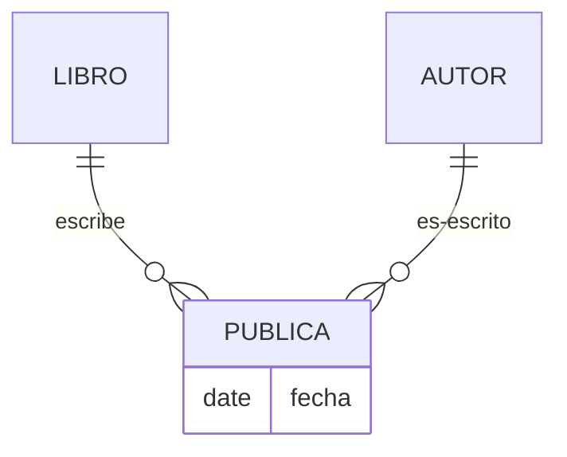

## Asociación, composición y agregación

La **asociación** es una relación entre **dos clases** separadas que se establece a través de sus Objetos. La asociación puede ser de uno a uno, de uno a muchos, de muchos a uno, de muchos a muchos. En la programación orientada a objetos, un objeto se comunica con otro objeto para usar la funcionalidad y los servicios proporcionados por ese objeto. **La composición y la agregación son las dos formas de asociación**.

La diferencia entre la composición y la agregación es que la primera representa una relación tipo `es parte` mientras que la segunda tiene una relación `tiene un`

Por ejemplo, la relación entre `Humamo` y `Corazón` es una composición porque el `Corazón` no puede existir sin el `Humano`. Sin embargo, la relación entre `Motor` y `Coche` es agregación porque el `Motor` sigue existiendo independientemente del `Coche`

La composición es una Asociación **fuerte** mientras que la agregación es **débil**.

## Relaciones 1:1

En el caso de las relaciones que son unívocas crearemos un atributo en la entidad principal que almacene una referencia a la entidad secundaria. 

Por ejemplo,



En este caso la entidad principal es  `PLANETA` ya que `ORBITA` depende de que el planeta exista:

```java
public class Orbita{
	private String nombre;
	private int radio
    //Se omite el constructor, getters y setters
}
```

```java
public class Planeta{
    private String nombre;
    private Orbita orbita;
	//Se omite el constructor, getters y setters
}
```

Otro ejemplo sería la relación entre `Coche` y `Motor` en la que ambas entidades son independientes

## Relaciones 1:N

En este caso crearemos un atributo en la parte 1 y una lista en la parte N

Por ejemplo:



```java
public class Editorial{
    private String nombre;
    private Set<Libro> libros;
	//Se omite el constructor, getters y setters
}
```

```java
public class Libro{
    private String titulo;
    private Editorial editorial;
	//Se omite el constructor, getters y setters
}
```

## Relaciones N:M sin atributos

En este caso hemos de crear un `Set` en cada una de las entidades que permita almacenar las entidades de la otra relación:



```java
public class Libro{
    private String titulo;
    private Set<Autor> autores;
	//Se omite el constructor, getters y setters
}
```

```java
public class Autor{
    private String nombre;
    private Set<Libro> libros;
    //Se omite el constructor, getters y setters
}
```

## Relaciones N:M con atributos

En este caso es necesaria una clase nueva que tenga un atributo para cada una de las entidades y además los atributos de la relación.



En este caso crearemos una nueva clase con referencias a `Libro` y a `Autor`

```java
 public class publica{
 	private Autor autor;
    private Libro libro;
    private String fecha;
    //Se omite el constructor, getters y setters
 }
```

---

**Adaptado en parte de:**

* [https://www.geeksforgeeks.org/association-composition-aggregation-java/](https://www.geeksforgeeks.org/association-composition-aggregation-java/)

