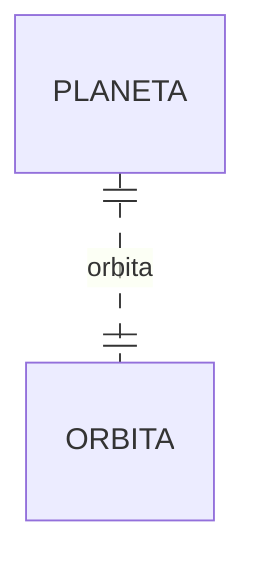
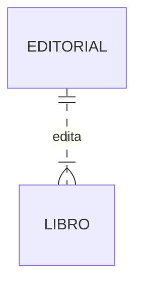
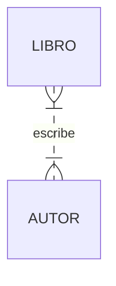
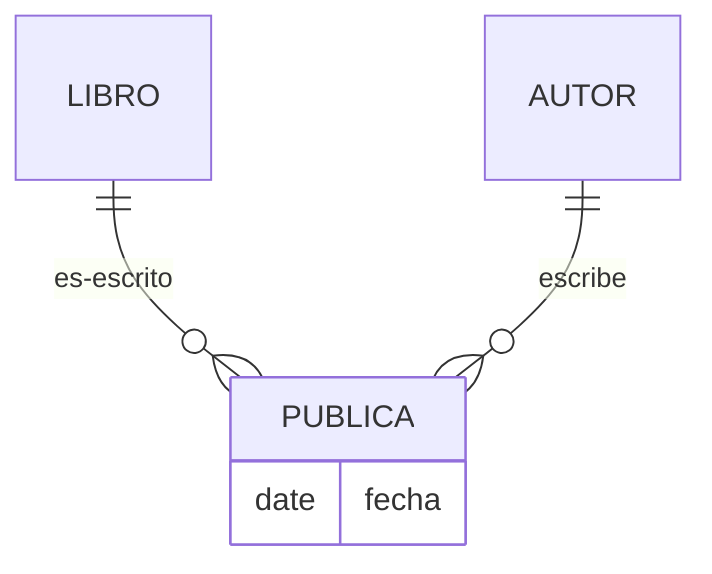

## Asociación, composición y agregación

<span style='color:green'> (ra2.a, ra2.b, ra2.h, ra2.i, ra4.a, ra4.b, ra4.c, ra4.d, ra4.e, ra4.g, ra4.i, ra6.c)</span>

La **asociación** es una relación entre **dos clases** separadas que se establece a través de sus Objetos. La asociación puede ser de uno a uno, de uno a muchos, de muchos a uno, de muchos a muchos. En la programación orientada a objetos, un objeto se comunica con otro objeto para usar la funcionalidad y los servicios proporcionados por ese objeto. **La composición y la agregación son las dos formas de asociación**.

La diferencia entre la composición y la agregación es que la primera representa una relación tipo `es parte` mientras que la segunda tiene una relación `tiene un`

Por ejemplo, la relación entre `Humamo` y `Corazón` es una composición porque el `Corazón` no puede existir sin el `Humano`. Sin embargo, la relación entre `Motor` y `Coche` es agregación porque el `Motor` sigue existiendo independientemente del `Coche`

La composición es una Asociación **fuerte** mientras que la agregación es **débil**.

## Relaciones 1:1

En el caso de las relaciones que son unívocas crearemos un atributo en la entidad principal que almacene una referencia a la entidad secundaria.

Por ejemplo,



En este caso la entidad principal es  `PLANETA` ya que `ORBITA` depende de que el planeta exista:

```java
public class Orbita{
	private String nombre;
	private int radio
    //Se omite el constructor, getters y setters
}
```

```java
public class Planeta{
    private String nombre;
    private Orbita orbita;
	//Se omite el constructor, getters y setters
}
```

Otro ejemplo sería la relación entre `Coche` y `Motor` en la que ambas entidades son independientes

## Relaciones 1:N

En este caso crearemos un atributo en la parte N y una lista en la parte 1

Por ejemplo:


Si empezamos por la clase `Editorial` todavía no existe la entidad `Libro`.
```java
public class Editorial{
    private String nombre;
	//Se omite el constructor, getters y setters
}
```

```java
public class Libro{
    private String titulo;
    private Editorial editorial;

	public Libro(String titulo, Editorial editorial){
        this.titulo = titulo;
        this.editorial = editorial;
    }
    //Se omiten getters y setters
}
```

Ahora ya podemos finalizar la clase `Editorial` con la lista de libros de su catálogo y creamos un método para poder añadir un libro a la lista.

```java
public class Editorial{
    private String nombre;
    //Como estamos en la parte 1 de la relación, creamos una
    //list con todos los libros de la misma (parte n)
    private List<Libro> libros = new ArrayList<>();

    public Editorial(String nombre){
        this.nombre = nombre;
    }

    //Además del setter por defecto, creamos otro para poder añadir un Libro
    public void addLibro(Libro libro){
        this.libros.add(libro);
    }
    //Devolver todos los libros. Como devuelve una lista, el nombre del método
    //va en plural
    public List<Libro> getLibros(){
        return this.libros;
    }
	//Se omiten getters y setters

}
```


## Relaciones N:M sin atributos

En este caso hemos de crear un lista en cada una de las entidades que permita almacenar las entidades de la otra relación:



```java
public class Libro{
    private String titulo;
    //Como estamos en la parte 1 de la relación, creamos una
    //list con todos los autores del mismo (parte n)
    private List<Autor> autores = new ArrayList<>();

    public Libro(String titulo){
        this.titulo = titulo;
    }
    public Libro(String titulo, Autor autor){
        this.titulo = titulo;
        // Añadimos este libro a la lista de libros del autor
        autor.getLibros().add(this);
    }
    //Se omiten getters y setters

    //Creamos un setter que nos permita añadir un autor a la lista
    public void addAutor(Autor autor){
        this.autores.add(autor);
        // Añadimos este libro a la lista de libros del autor
        autor.getLibros().add(this);

    }
    //Devolver todos los autores del libro. Como devuelve una lista,
    //el nombre del método debe estar en plural
    public List<Autor> getAutores(){
        return this.autores;
    }
}
```

```java
public class Autor{
    private String nombre;
    private List<Libro> libros = new ArrayList<>();

    public Autor(String nombre){
        this.nombre = nombre;
    }
    //Se omiten getters y setters

    //Creamos un setter que nos permita añadir un libro a la lista
    public void addLibro(Libro libro){
        this.libros.add(libro);
        libro.getAutores().add(this);
    }

    //Devolver todos los libros del autor. Como devuelve una lista,
    //el nombre del método debe estar en plural
    public List<Libro> getLibros(){
        return this.libros;
    }
}
```

## Relaciones N:M con atributos

En este caso es necesaria una clase nueva que tenga un atributo para cada una de las entidades y además los atributos de la relación.



En este caso crearemos una nueva clase con referencias a `Libro` y a `Autor`

```java
 public class Publica{
 	private Autor autor;
    private Libro libro;
    private String fecha;
    //Se omite el constructor, getters y setters
 }
```

Además, en cada parte de la relación crearemos un `ArrayList` para mantener la lista de los libros publicados por un autor y la lista de los autores de un libro.

```java
public class Libro{
	//...
    private List<autor> autores = new ArrayList<>();

    //Creamos un setter para poder añadir un autor
    public void addAutor(Autor autor){
        this.autores.add(autor);
    }
}
```

```java
public class Autor{
    private List<Libro> libros = new ArrayList<>();

    //Creamos un setter para poder añadir un autor
    public void addLibro(Libro libro){
        this.libros.add(libro);
    }
}
```

**Adaptado en parte de:**

* [https://www.geeksforgeeks.org/association-composition-aggregation-java/](https://www.geeksforgeeks.org/association-composition-aggregation-java/)
